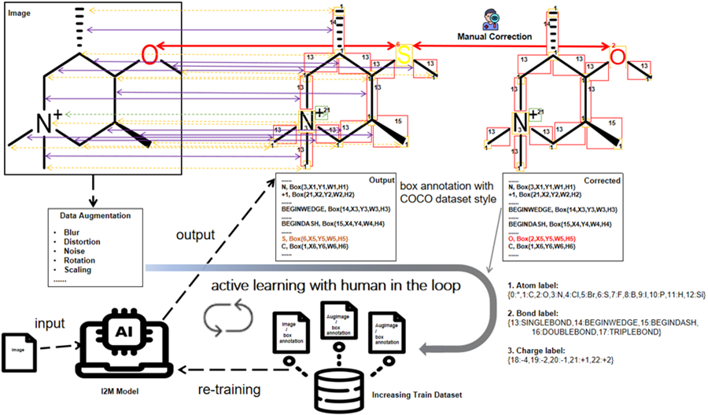

# I2M: Enhancing Chemical Structure Recognition with image-to-molecule Generation

## 1. Overview

This repository contains the core implementation of a chemical structure recognition system that converts molecular images into structured SMILES representations.

The system implements a complete end-to-end pipeline including:
- Data generation and augmentation  
- Image parsing model (based on improved RT-DETR)  
- Molecular graph construction  
- Molecular reconstruction with stereochemistry  
- SMILES generation  

## 2. System Pipeline

Input Image
→ Backbone Feature Extraction
→ Hybrid Encoder (with Adapter)
→ Transformer Decoder
→ Query Selection
→ Bounding Boxes (atoms / bonds)
→ Graph Construction
→ Molecule Reconstruction
→ SMILES Output

## 3. Code Structure

code/
├── src/
├── tools/
├── aug/
├── requirements.txt

## 4. Training

torchrun tools/train.py --config configs/xxx.yml

## 5. Inference

python tools/infer.py

Pipeline:
Image → Detection → Graph → Molecule → SMILES

## 6. Experimental Outputs

- log.txt  
- best_checkpoint.pth  
- SMILES CSV  
- visualization results  

## 7. Full Code and Data

Google Drive:
https://drive.google.com/file/d/1UrM1M_xVtYmjeK1mDMUnfGT7BAbpQOXH/view?usp=sharing

## 8. Public Datasets

Training:
https://zenodo.org/records/15823641  

Testing:
https://zenodo.org/records/16034987  

Pretrained:
https://huggingface.co/spaces/ksubowu/i2mdeom/tree/main  

## 9. RT-DETR Training Details

Install:
pip install -r requirements.txt  

Single GPU:
export CUDA_VISIBLE_DEVICES=0  
python tools/train.py -c configs/I2Mol_rtdetr/I2Mol_rtdetr_r50vd_6x_coco.yml  

Multi GPU:
export CUDA_VISIBLE_DEVICES=0,1,2,3  
torchrun --nproc_per_node=4 tools/train.py -c configs/I2Mol_rtdetr/I2Mol_rtdetr_r50vd_6x_coco.yml  

Evaluation:
torchrun --nproc_per_node=4 tools/train.py -c configs/... -r checkpoint --test-only  

Export ONNX:
python tools/export_onnx.py -c configs/... -r checkpoint --check  

## Model Zoo

| Model | Dataset | Input Size | APval | AP50val | #Params(M) | FPS |  checkpoint |
| :---: | :---: | :---: | :---: | :---: | :---: | :---: | :---: |
I2Mol_rtdetr_r18vd | COCO | 640 | 46.4 | 63.7 | 20 | 217 | [url*](https://github.com/lyuwenyu/storage/releases/download/v0.1/rtdetr_r18vd_dec3_6x_coco_from_paddle.pth)
I2Mol_rtdetr_r34vd | COCO | 640 | 48.9 | 66.8 | 31 | 161 | [url*](https://github.com/lyuwenyu/storage/releases/download/v0.1/rtdetr_r34vd_dec4_6x_coco_from_paddle.pth)
I2Mol_rtdetr_r50vd | COCO | 640 | 53.1 | 71.2| 42 | 108 | [url*](https://github.com/lyuwenyu/storage/releases/download/v0.1/rtdetr_r50vd_6x_coco_from_paddle.pth)
I2Mol_rtdetr_18vd | COCO+Objects365 | 640 | 49.0 | 66.5 | 20 | 217 | [url*](https://github.com/lyuwenyu/storage/releases/download/v0.1/rtdetr_r18vd_5x_coco_objects365_from_paddle.pth)
I2Mol_rtdetr_r50vd | COCO+Objects365 | 640 | 55.2 | 73.4 | 42 | 108 | [url*](https://github.com/lyuwenyu/storage/releases/download/v0.1/rtdetr_r50vd_2x_coco_objects365_from_paddle.pth)
I2Mol_rtdetr_r101vd | COCO+Objects365 | 640 | 56.2 | 74.5 | 76 | 74 | [url*](https://github.com/lyuwenyu/storage/releases/download/v0.1/rtdetr_r101vd_2x_coco_objects365_from_paddle.pth)

Notes
- `COCO + Objects365` in the table means finetuned model on `COCO` using pretrained weights trained on `Objects365`.
- `url``*` is the url of pretrained weights convert from paddle model for save energy. *It may have slight differences between this table and paper*
<!-- - `FPS` is evaluated on a single T4 GPU with $batch\\_size = 1$ and $tensorrt\\_fp16$ mode -->

## 11. Reproducibility

This project provides:
- Complete model implementation  
- Full training pipeline  
- Public datasets and weights  

## 12. Notes

Image → Structure → SMILES pipeline fully implemented.

## 13. Train custom data

1. set `remap_mscoco_category: False`. This variable only works for ms-coco dataset. If you want to use `remap_mscoco_category` logic on your dataset, please modify variable [`mscoco_category2name`](https://github.com/lyuwenyu/RT-DETR/blob/main/rtdetr_pytorch/src/data/coco/coco_dataset.py#L154) based on your dataset.

2. add `-t path/to/checkpoint` (optinal) to tuning rtdetr based on pretrained checkpoint. see [training script details](./tools/README.md).
